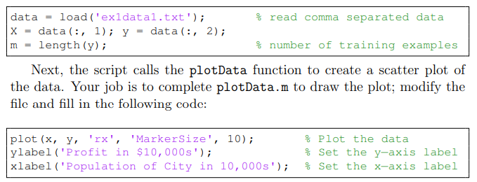

# 实验一、单变量线性回归*Linear Regression with one variable*
<p style="color: #a8F">Linear Regression with one variable</p>
```回归问题预测连续值, 分类问题预测离散值, 它们同属于监督学习任务, 对应的是无监督学习, 通常任务描述为聚类的划分或者数据的结构划分or发现。单变量是指对于属性值或者预测值，影响它的因素（称之为属性或者特征）只有一个。线性是针对预测模型算法而言的，或者说称之为假设函数，他是一个线性的函数，或者称之为一次函数，它的可变参数是2个。```
1. 实验描述
    * In this part of this exercise, you will implement linear regression with one variable to **predict profits for a food truck**. Suppose you are the CEO of a restaurant franchise and are considering different cities for opening a new outlet. The chain already has trucks in various cities and you have data for profits and populations from the cities.
    * You would like to use this data to help you select which city to expand to next. The file ex1data1.txt contains the dataset for our linear regression problem. The first column is the population of a city and the second column is the profit of a food truck in that city. A negative value for profit indicates a loss.
    * 在本实验中, 假定你是一个连锁餐厅的总经理, 现在想向外拓展业务, 也即选择一个城市再开一家店, 假定在某城市开店的利润(profits)仅与城市人口(population)有关, 并且已经开的连锁餐厅的营收数据已知, 数据已经给出, 你的任务是given the population of a city and predict profits for a food truck

--------
2. 实验步骤
   1. 将数据集plot出来
   
   2. 写出$h(x)(hypothesis)$假设函数, 也即假定的目标值对于x的函数
   3. 写出代价函数$J(\theta)$(cost function)
   4. 利用梯度下降算法求解(gradient descent)
   5. plot the loss function

-----------
3. 实验记录
   1. [jupyter notebook 更换主题](https://www.cnblogs.com/shanger/p/12006161.htm)
    pip install jupyterthemes
    grade3
    jt -t grade3 -f fira -fs 17 -cellw 90% -ofs 15 -dfs 15 -T -T
   
   2. [关于dataframe删除某一行或某一列的方法](https://blog.csdn.net/qiwsir/article/details/114867900)
   ```python
   df.drop(0)                # drop a row, on axis 0 or 'rows'
   df.drop(0, axis=0)        # same
   df.drop(0, axis='rows')   # same
   df.drop(labels=0)         # same
   df.drop(labels=[0])       # same

   df.drop('b', axis=1)         # drop a column
   df.drop('b', axis='columns') # same
   df.drop(columns='b')         # same
   df.drop(columns=['b'])       # same
   ```
4. 实验感受
   一点bug能给你卡半天, 就比如画图, 你散点图直接用原始数据就好了, 不要类型转来转去的
   原来list不能乘上浮点数, 但ndarray可以, 使用np.linespace就可以
   一定要自己推导，尤其是涉及到矩阵运算、向量运算，记得先瞄一眼切片什么的是不是对的，然后看形状，
   你做的这一个矩阵乘法它有没有意义，和拿一个推出来的公式它符不符合

5. 明天的计划是接着看课程，希望可以看完24，内容包含一个 **多元线性回归** 以及 一个 solution
也就是完全意义上的数学推导 **正规方程**也是先看看书，再去看看视频(周三), 回顾一下今天（昨晚写的代码）这里可能涉及一个实验（多元线性回归）

6. 后天可能 做一做实验 , 看看书, 整理一下笔记, 步调缓一下(周四)


