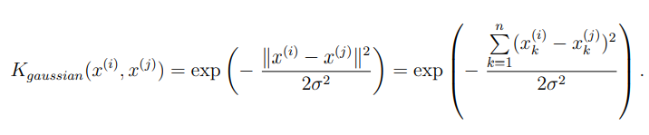

# 支持向量机实验记录
## 实验步骤
<font face="宋体" size=4>

### **实验介绍**
&emsp;&emsp;在本次实验中，你将会使用SVMs来建立一个垃圾邮件过滤器(spam classifier)。在进行编程练习前，我强烈建议你观看相关的课程视频并解答对应的习题。
### **实验预热**
1. Support Vector Machines
   在前半部分的练习中，你将会使用支持向量机处理多种不同的2维数据集，数据仅包含两个特征维度且具有线性的决策边界。另外，强烈建议你使用不同的参数值C并作出样本-决策边界图来体会C的作用
2. 使用高斯核(Gaussian Kernels)的SVM
   在这一部分的练习中，你将应用SVMs到非线性决策中。首先你需要实现一个高斯核，他是一个衡量一对示例的距离的函数，其中的参数包括$\sigma$，它控制着当两个样本距离拉远时度量变为0的速度

   <div align=center></div>

   在这里，有两个数据集可供练习。在第二个数据集中包含一个训练集和一个交叉验证集$(X, y) - (Xval, yval)$，你的任务是利用$(Xval, yval)来决定最佳的$C$和$\sigma$。它们的值可以从0.01, 0.03, 0.1, 0.3, 1, 3, 10, 30中选取，一共64种组合。
   得到最佳参数值后，请作出样本-决策边界图形

### **垃圾邮件过滤**
&emsp;&emsp;You will be training a classifier to classify whether a given email, x, is spam (y = 1) or non-spam (y = 0). In particular, you need to convert each email into a feature vector $x\in R^n$. The following parts of the exercise will walk you through how such a feature vector can be constructed from an email.
&emsp;&emsp;The dataset included for this exercise is based on  a subset of the SpamAssassin Public Corpus.For the purpose of this exercise, you will only be using the body of the email (excluding the email headers).
&emsp;&emsp;Before starting on a machine learning task, it is usually insightful to take a look at examples from the dataset. Figure 8 shows a sample email that contains a URL, an email address (at the end), numbers, and dollar amounts. While many emails would contain similar types of entities (e.g. numbers, other URLs, or other email addresses), the specific entities (e.g. the specific URL or specific dollar amount) will be different in almost every email. Therefore, one method often employed in processing emails is to “normalize” these values, so that all URLs are treated the same, all numbers are treated the same, etc. For example, we could replace each URL in the email with the unique string "httpaddr" to indicate that a URL was present. This has the effect of letting the spam classifier make a classification decision based on whether any URL was present, rather than whether a specific URL was present. This typically improves the performance of a spam classifier, since spammers often randomize the URLs, and thus the odds of seeing any particular URL again in a new piece of spam is very small.

#### ***preprocessing and normalization steps***
* Lower-casing: the entire email is converted into lower case
* Stripping HTML: all html tags are removed
* Normalizing URLs: all url are replaced with the text "httpaddr"
* Normalizing Email Addresses: all email addresses are replaced with the text "emailaddr"
* Normalizing Dollars: All dollar signs ($) are replaced with the text dollar.
* word stemming: words are reduced to their stemmed form.
* removal of non-words: Non-words and punctuation are replaced by a single space character.

#### ***vocabulary list***
&emsp;&emsp;The complete vocabulary list is in the file $vocab.txt$ and also shown in Figure 10. Our vocabulary list was selected by choosing all words which occur at least a 100 times in the spam corpus, resulting in a list of 1899 words. In practice, a vocabulary list with about 10,000 to 50,000 words is often used.
&emsp;&emsp;Given the vocabulary list, we can now map each word in the preprocessed emails (e.g., Figure 9) into a list of word indices that contains the index of the word in the vocabulary list. If the word does not exist, and is therefore not in the vocabulary, you can skip the word.

#### ***Extracting Features from Emails***
&emsp;&emsp;Specifically, the feature $x_i \in {0, 1}$ for an email corresponds to whether the $i$-th word in the dictionary occurs in the email. That is, $x_i$ = 1 if the $i$-th word is in the email and $x_i = 0$ if the $i$-th word is not present in the email.
&emsp;&emsp;You should now complete the code in emailFeatures.m to generate a feature vector for an email, given the word indices. After you have completed the feature extraction functions, the next step of ex6 spam.m will load a preprocessed training dataset that will be used to train a SVM classifier. spamTrain.mat contains 4000 training examples of spam and non-spam email, while spamTest.mat contains 1000 test examples. Each original email was processed using the processEmail and emailFeatures functions and converted into a vector $x_{(i)}\in \Reals^1899$. After loading the dataset, ex6 spam.m will proceed to train a SVM to classify between spam (y = 1) and non-spam (y = 0) emails. Once the training completes, you should see that the classifier gets a training accuracy of about 99.8% and a test accuracy of about 98.5%.

</font>

## 关键过程的理解与代码实现
<font face="宋体" size=4>

1. xxx
2. xxx
3. xxx
4. xxx
5. xxx

</font>

## 完整的代码实现
```python
import numpy as np

```

## 遇到的问题与解决方法
<font face="宋体" size=4>

### **关于github无法访问的问题**
&emsp;&emsp;首先是浏览器无法访问 github.com ，网页加载不出来，这一问题网上的解决办法是：先查询github.com的ipv4地址，接着将该地址复制粘贴到host文件形成映射，然后刷新DNS缓存，具体做法是打开CMD，键入命令`ipconfig /flushdns`后回车，最后通过`ping github.com`验证发现可以ping通，这样就ok啦。实际上了，到这一步可能都成功了，但是网页仍然访问不稳定，就像在掷骰子--**这将使你异常烦躁**。一个终极解决方案是使用**Dev-SideCar**，这是一个神器，网页秒开，珍惜使用吧！关于github非正常访问的问题，可能是DNS污染，为什么从去年开始突然会有这样的污染，不可说。
&emsp;&emsp;其次是git push报错，例如**某某文件过大**、**连接超时**、**SSL校验错误**等等。尤其是连接超时，解决办法千奇百怪，不一定都适用，并且可能在解决的过程中产生新的问题。一个办法是
```git
git config --global https.proxy
git config --global --unset https.proxy
```
也就是git代理多开关几次，注意这时devsidecar可以关咯，然后通过
```git
git config --global -l
```
查看哪些设置是被更改的（如果有些地方误设，还请取消掉）
10月10日更新，实际上，或许当出现提交错误时，一个简单有效的方法是查询最新的ip地址再粘贴上，其他的都不用动，虽然这么做可能一段时间后就会失效，但他简单且不费力。

10-10-10-27更新
1. Github520+SwitchHosts自动更新
2. Steam++加速器，各种加速

### **$sklearn.svm.LinearSVC$**
[sklearn.svm.LinearSVC](https://blog.csdn.net/qq_44669578/article/details/103342934)
```python
svm1 = sklearn.svm.LinearSVC(C=1.0,loss='squared_hinge')
svm1.fit(X,Y.ravel())
svm1.score(X,Y)   #返回的是最后的平均“得分”，反映了预测的好与坏
p1,p2 = svm1.coef_[0]   #个参数的权重系数
b = svm1.intercept_[0]  #截距值
print(p1, p2, b)
plt.scatter(X1,X2,c = Y)
plt.plot(X1,-p1/p2*X1 - b/p2)
plt.show()
```
### **SVM到底是什么？**
&emsp;&emsp;看完WuEg的视频，你懂SVM了吗？西瓜书上面的介绍，那公式推导你知道在干嘛？理念似乎很简单，但一旦仔细去看就会发现：？？？我学了个啥？我在查SVC函数的使用发现了这些博客: **这周可不可以看懂**
[《机器学习实战》学习笔记（六）：支持向量机](https://blog.csdn.net/TeFuirnever/article/details/99701322)
[支持向量机通俗导论（理解SVM的三层境界）](https://blog.csdn.net/v_july_v/article/details/7624837)
[Python3《机器学习实战》学习笔记（八）：支持向量机原理篇之手撕线性SVM](https://blog.csdn.net/c406495762/article/details/78072313)
</font>