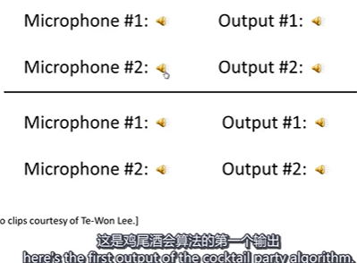
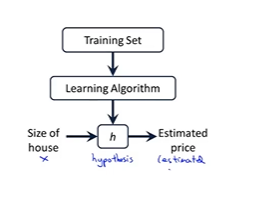

## 机器学习的发展与应用

## 什么是机器学习

监督学习 or 无监督学习(`Unsupervised Learning`)
如何选择（使用）学习算法、什么时候用什么算法、模型的选择很重要
* `Supervised Learning`
  `Regression Problem` <-- 房屋价格的预测
  `Classification`分类学习 
  feature特征
* `Unsupervised Learning`
  here is the dataset, we don't know what to do with it, but can we cluster it into different pieces depeding various perspective?
  
  例如 上网搜索关于某事件（例如唐山打人）的新闻
  
  
  另外一种问题
  
  鸡尾酒会算法
  
  octave 
  
* 房价预测示例`Univariate linear regression` 单变量线性回归
  `hypothesis` -- a function map x to y
  
  
* Cost Function 代价函数、损失函数
  关系到如何选取 $\ce{\theta0, \theta1}$ 

   

