# 房价预测——一个单变量线性回归问题的解决过程

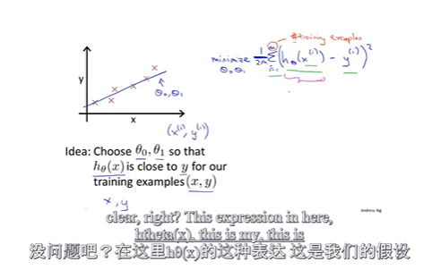
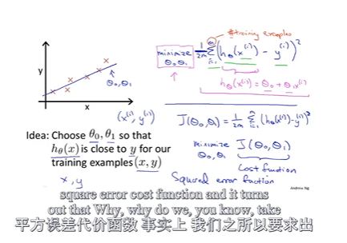
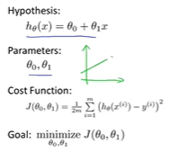
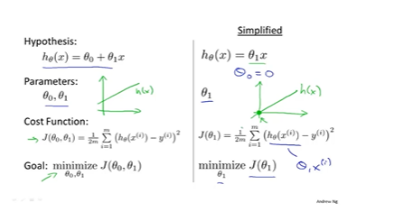

### 使用 gradient descent 使 $\ce{J(\theta0, \theta1)}$ 最小
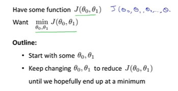
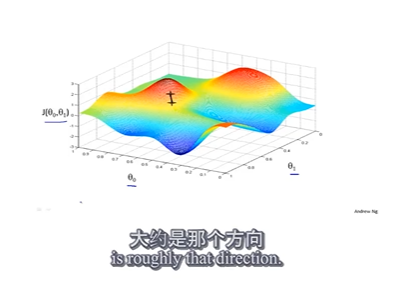
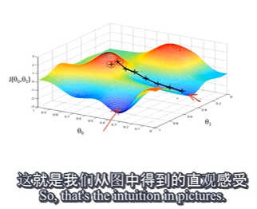
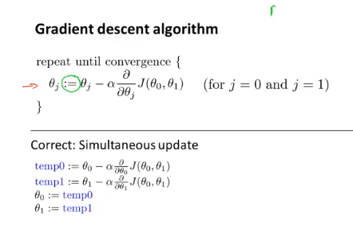
${\alpha},means,learning,rate$
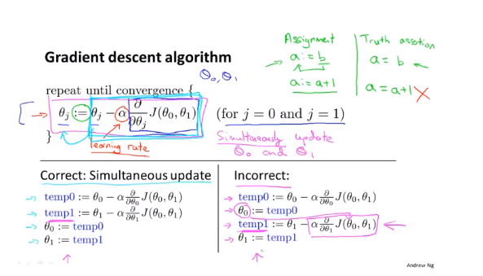
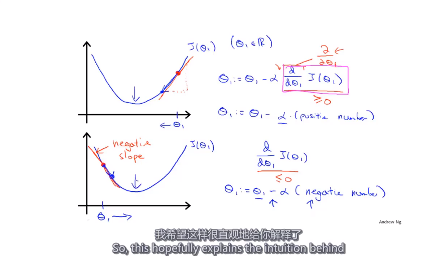
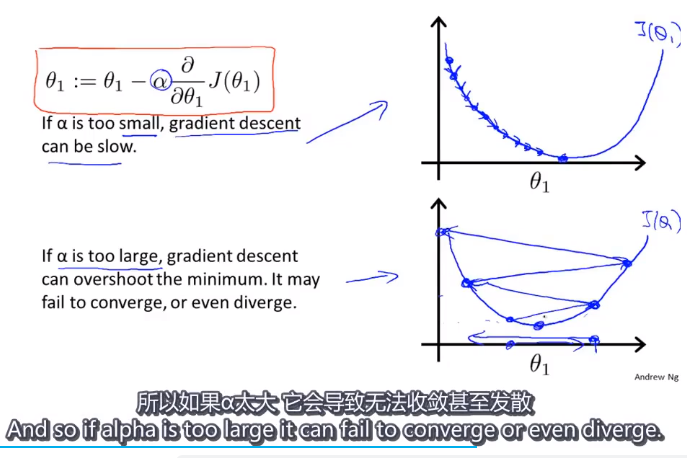
$\alpha$ no need to dcrease over time
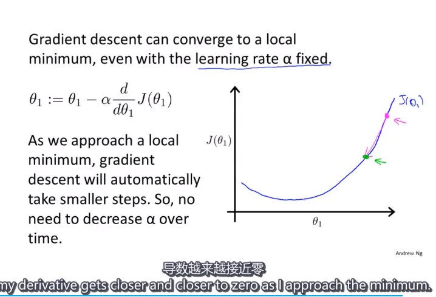

to carry out them with code
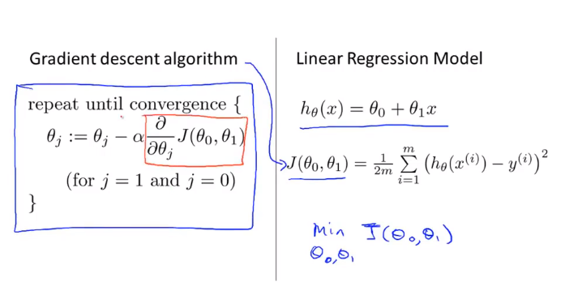
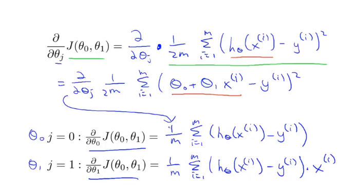
$what$ $is$ $batch$ $?$
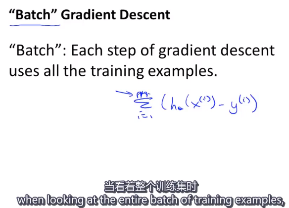

