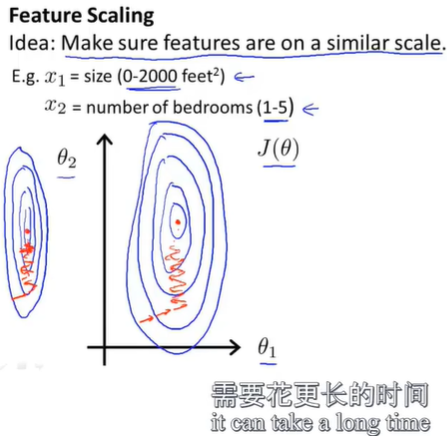
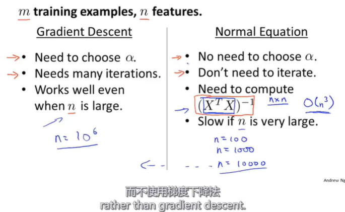

## $linear$ $Algebra$ $review$ 
$scalar$ $multiply$ 标量乘法
$commutative$ 可交换的
$associative$ $property$ 可结合性
$Identity$ $Matrix$ $I\times A=A\times I=A$
**$martix$ $inverse$ 方阵的逆**
$square$ $matrix$
**$singular$ $or$ $degenerate$ 没有逆的矩阵**
$transpose$ $A^T$ 转置

## $Linear$ $Regression$ $with$ $mutiple$ $variables$ $(features)$
Notation
$n$ = number of features
$m$ = size of training set
$x^{(i)}$ = the $i^{th}$ sample(instance/example) of training set, which is a n-dimmension vector
$x^{(i)}_j$ = value of feature $j$ in $i^{th}$ sample
____
#### $how$ $to$ $express$ $hypothesis$ $for$ $LRM$

#### $Gradient$ $descent$ $in$ $practice:$ $feature$ $scaling$

#### $Gradient$ $descent$ $in$ $practice:$ $learning$ $rate$ $\&$ $debugging$
$debugging$: how to make sure that GD works correctly

$learning$ $rate$: how to choose $\alpha$

#### $Features$ $and$ $polynomial$ $regression$
* how we choose appropriate features

#### 正规方程组($Solution$)
求偏导, 置为0, 得方程组, 求解之

结果是

#### $Vectorize$

