# 逻辑回归-离散值的预测
whether tumor is malignant?
can linear regression work?
image we set a threshold
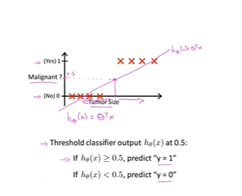

sigmoid function
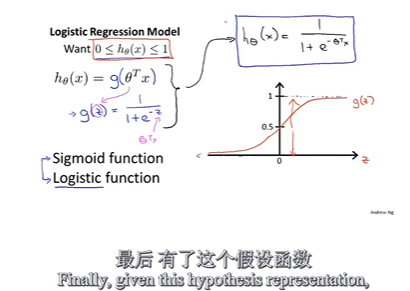

interpretation of $h_\theta$
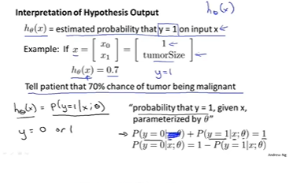 
how we fit the arguments?

decision boundary
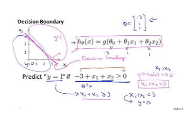
none linear
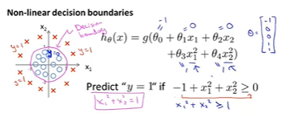
how we describe cost func
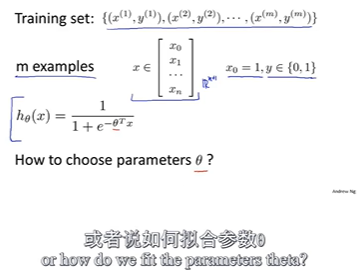
here we discuss it
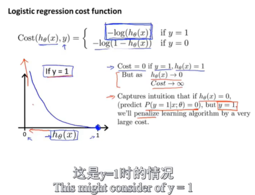
this function will give us a convex problem and local optimal free, from max-likelihood method

simplified cost function and gradient descent
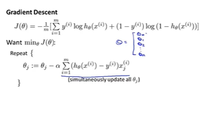

advanced optimization algorithm
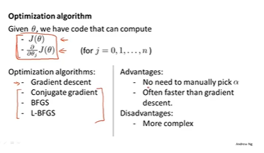

Logistic Regression
multi-class classification: one-vs-all
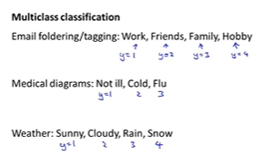
one -vs- rest
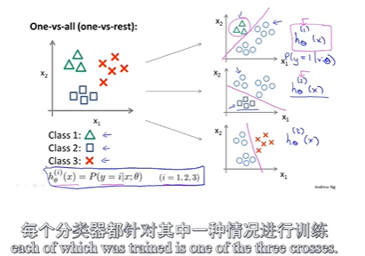

overfitting probelm(过拟合)
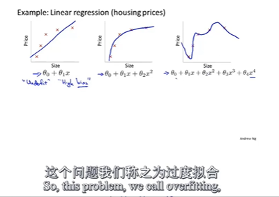
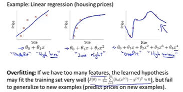
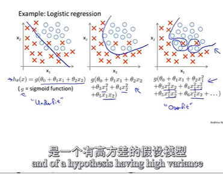
two main method
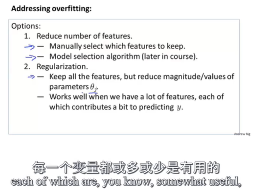

regulation (正则化)
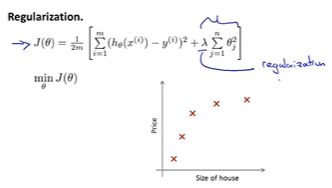
2022-09-25 正则化后的更新过程
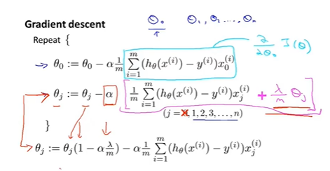
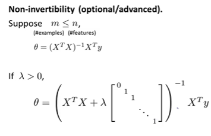

忽然想到一个问题就是python能画隐函数图像吗？

