# Neural Networks -- NoneLinear Hypothesis
* how we learn it?thousthands of program?
 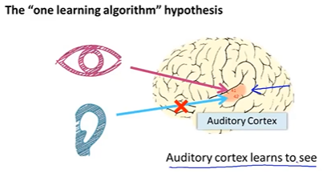
* it is so amazing
 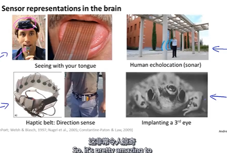

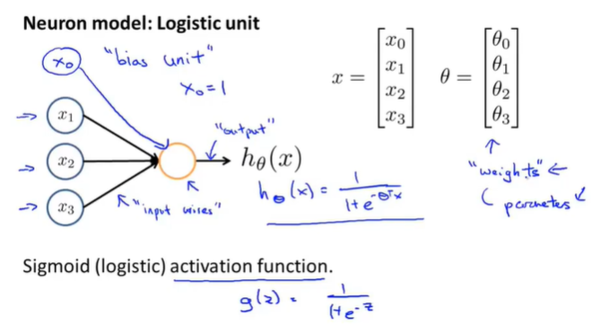

详细的计算过程
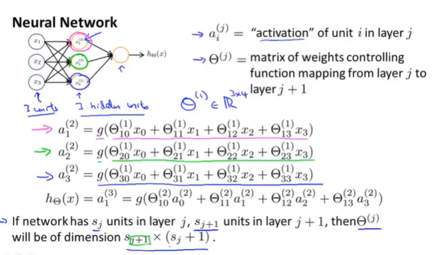
vectorized
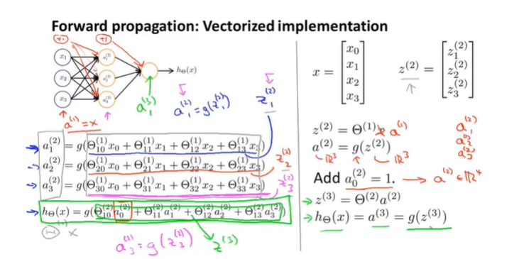
some intuition
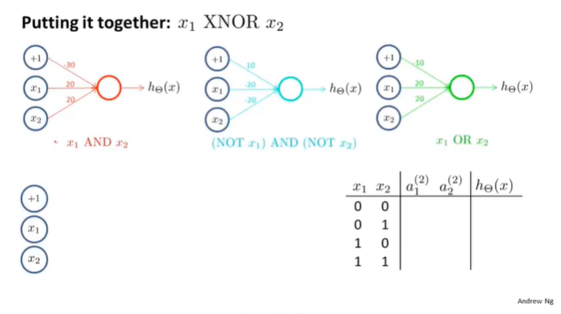
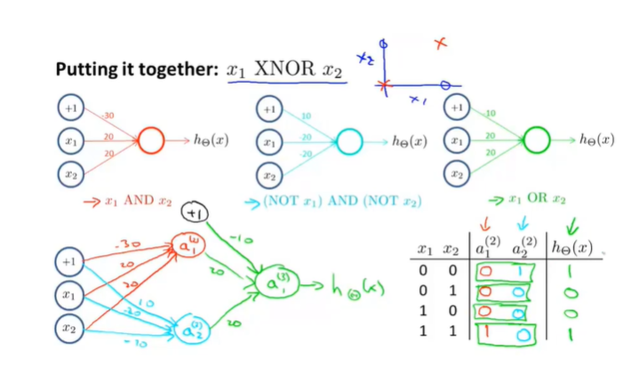
 
* multiclass classification
  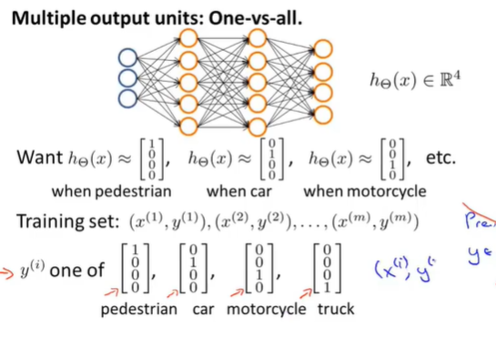

* Cost Function of NN
  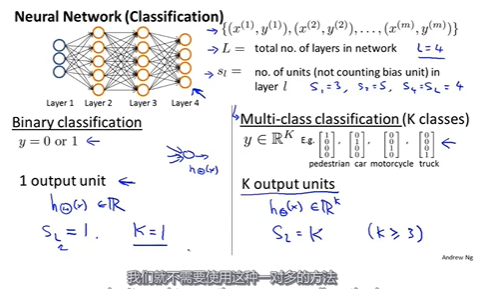
  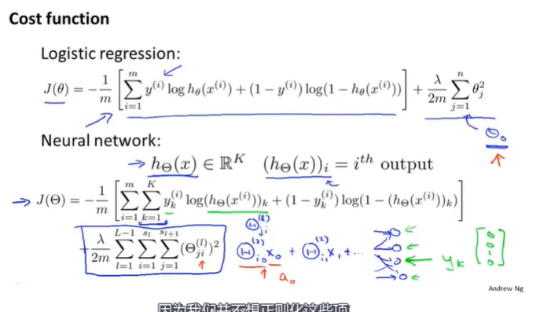

* gradient descent
  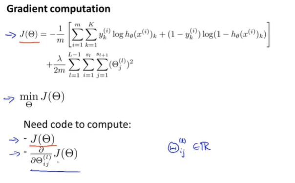
  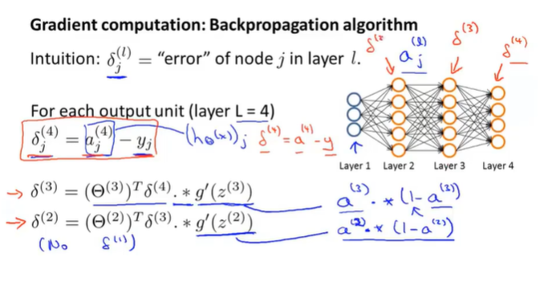
  $J'(\theta)$
  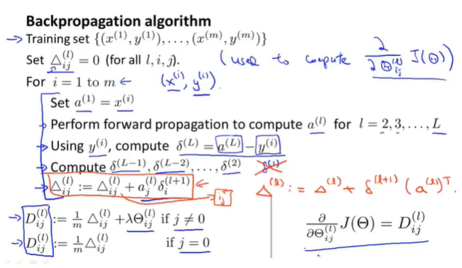

* intuition
  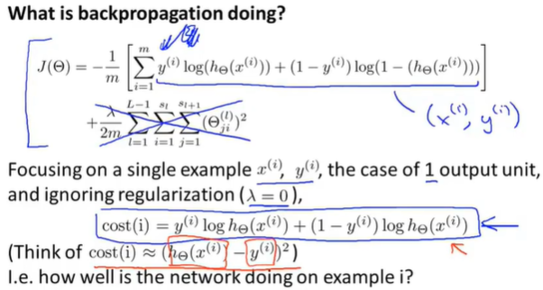

* gradient checking
  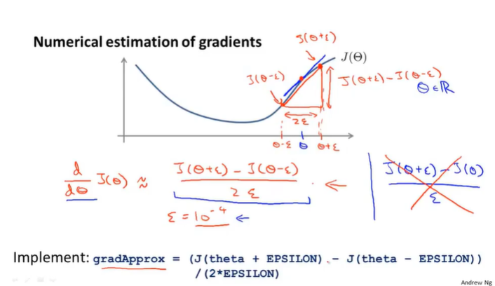
  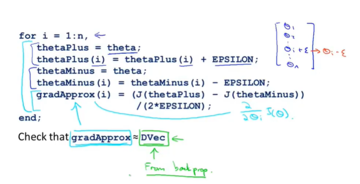
  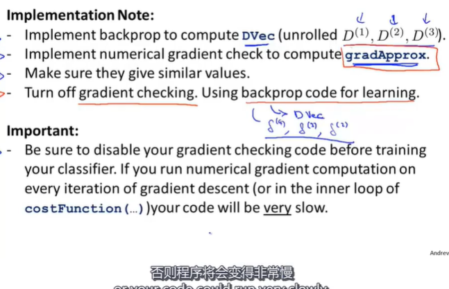

* random initialization
  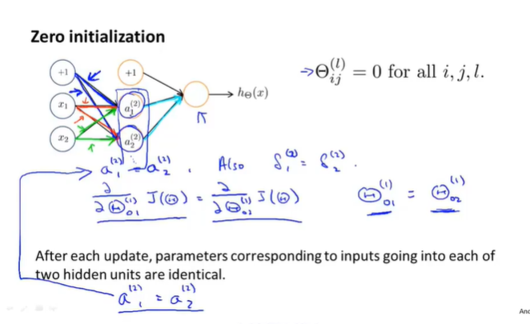
  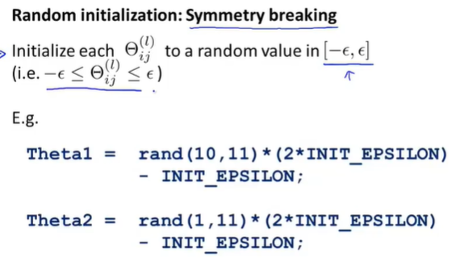
* To summarize
  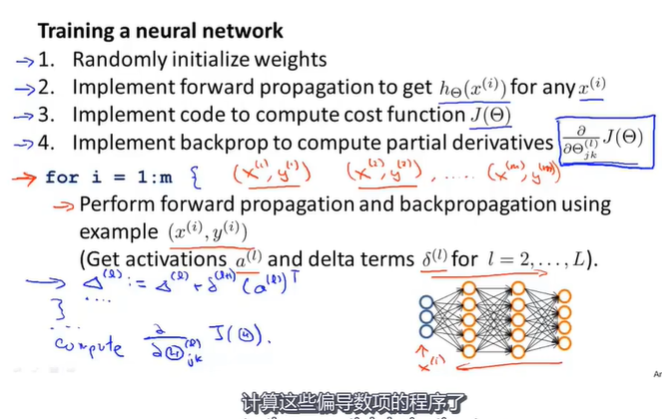
  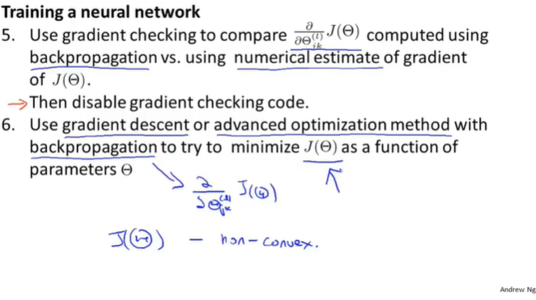