# Model Performance Estimation 模型性能评价
*从哪些方面去评价模型的好坏？或者说如何去定义好坏？我应当如何选择模型？如何更好地利用训练数据？*

---
* Debugging a learning algorithm
  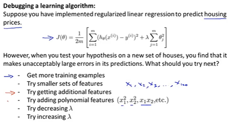
* Evaluating your hypothesis
  如何检测假设函数的好坏（泛化性能）？通常特征很多无法可视化，此时需要一定的数据手段
  1. 将数据集直接划分为两个部分--训练集和测试集，划分时尽可能保证数据分布的一致性，同时划分方式可以有多种，因此可以进行多次划分取均值
* Model Selection
  如何选择多项式的次数
  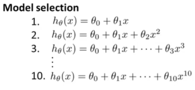
  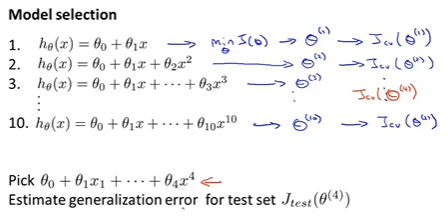
* bias or variance
  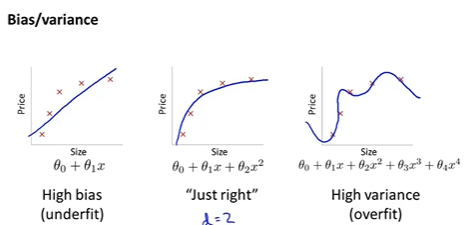
  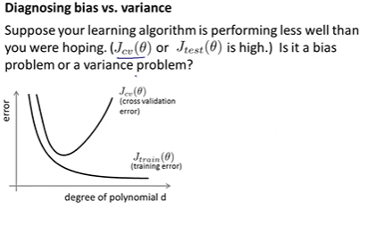
* m-err curve
  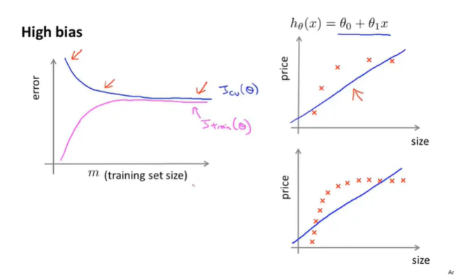
  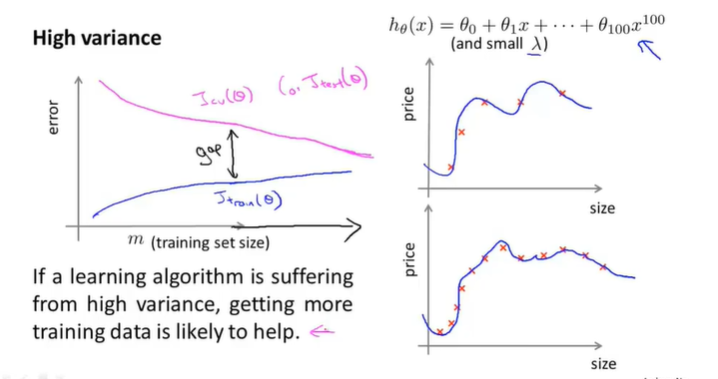
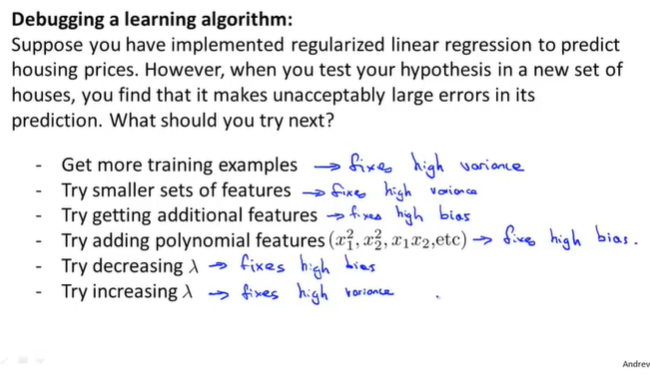
---

* Machine Learning System Design
  * spam classifier
  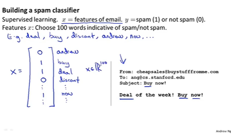
  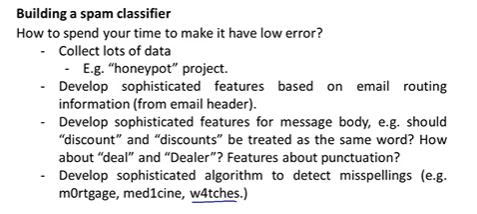
* Error Analysis
  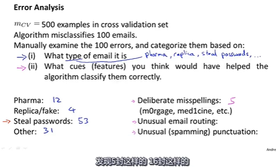
  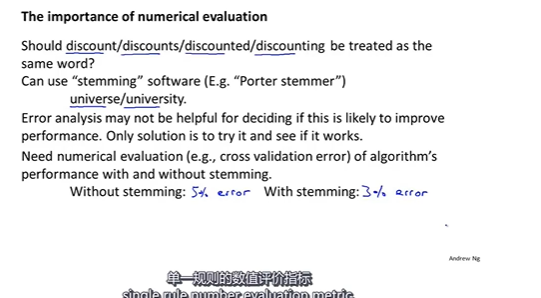

* skewed class(偏斜类)
  例如癌症预测，健康人的占比很高很高，此时若总是预测为健康，也会得到很低的错误率
  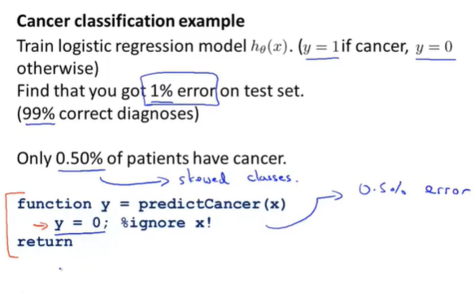
  * 混淆矩阵
  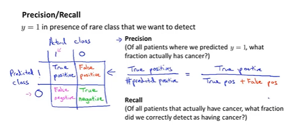
  * recall precision
  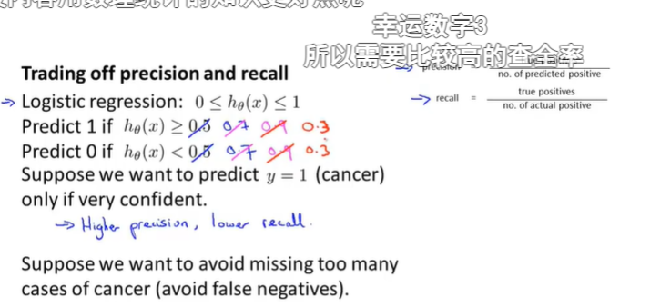
  * F val
  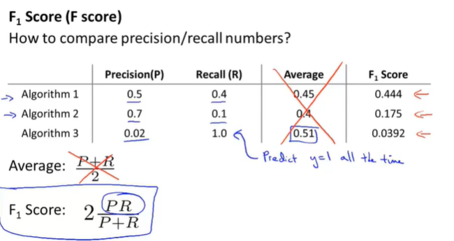

* data
  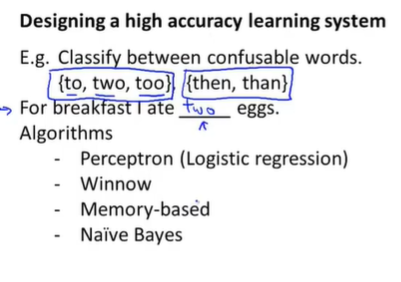
  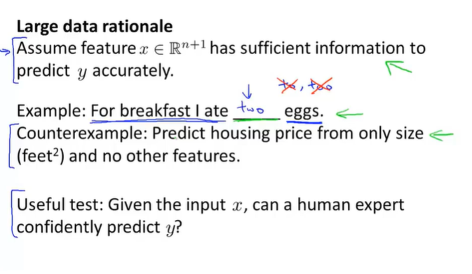
  
