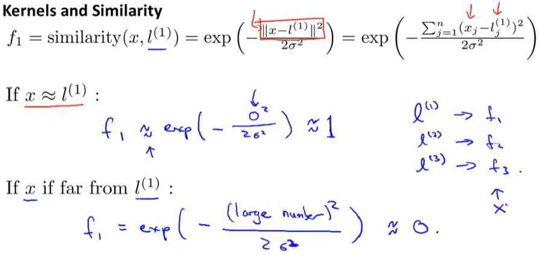

# Support Vector Machine(SVM)

* start from cost function
  
  
---
* intuition of SVM - robustness
  
  large margin classifier
---
* mathematical reference
  * [方向导数与梯度](https://blog.csdn.net/myarrow/article/details/51332421)
  * [拉格朗日乘数法（Lagrange Multiplier Method）](https://blog.csdn.net/qaqwqaqwq/article/details/123421989)
  * [勾股定理](https://xinzhi.wenda.so.com/a/1605259894202383)
  * [三角形余弦定理](http://www.gaosan.com/gaokao/81357.html)
  * [向量的点乘](https://blog.csdn.net/dcrmg/article/details/52416832)
* [conda虚拟环境的使用](https://zhuanlan.zhihu.com/p/94744929)
  ```bat
  conda create -n env_name python=x.xx
  conda info -e
  conda activate env_name
  conda deactivate
  ```
  
# 支持向量机
## 优化目标
&emsp;&emsp;基于对率损失函数的单样本示例，把sigmoid核函数代入，再分$y=1$以及$y=0$的情况进行讨论
<div align =center></div>

&emsp;&emsp;修改后得到了支持向量机的损失函数形式<br>

<div align =center></div>

$\theta^Tx>=1 \equiv y=1$
$\theta^Tx<=-1 \equiv y=0$

异常点对SVM的影响，可以对C进行修改以得到适合的决策边界
<div align =center></div>

数学原理--直观感受
当C很大时，总体优化目标的前半部分约为0，主要在于正则化项的优化
<div align =center></div>

因此，现在的最优化目标变为了最小化$\theta$的长度，同时$\theta^Tx=Proj_x^\theta\times||\theta||$，决策边界与$\theta$向量垂直，最小化$||\theta||$又转化为使得$Proj_x^\theta$最大，也即使得两类样本在$\theta$方向上的差距越大越好。
<div align =center></div>

非线性的决策边界
不同于高维的多项式特征，是否可以使用其他的方式进行特征构造？
例如，假设原来有两个特征$x_1$和$x_2$，现在选定三个标记点(landmark)亦即$l^{(1)}$、$l^{(2)}$、$l^{(3)}$。接着使用相似度构造三个特征

<div align =center></div>

理解他们如何工作？
<div align =center></div>

如何选取$l^{(i)}$, 也即m个样本点
<div align =center></div>
<div align =center></div>
<div align =center></div>
参数的选择与调整--高斯核函数
<div align =center></div>
使用SVM进行模型训练
<div align =center></div>
各种算法的比较
<div align =center></div>
