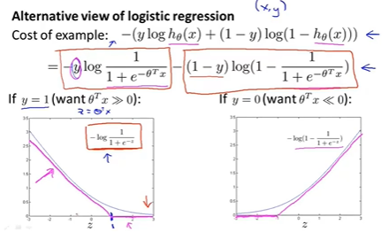

# Support Vector Machine(SVM)

* start from cost function
  
  
---
* intuition of SVM - robustness
  
  large margin classifier
---
* mathematical reference
  * [方向导数与梯度](https://blog.csdn.net/myarrow/article/details/51332421)
  * [拉格朗日乘数法（Lagrange Multiplier Method）](https://blog.csdn.net/qaqwqaqwq/article/details/123421989)
  * [勾股定理](https://xinzhi.wenda.so.com/a/1605259894202383)
  * [三角形余弦定理](http://www.gaosan.com/gaokao/81357.html)
  * [向量的点乘](https://blog.csdn.net/dcrmg/article/details/52416832)