# 聚类分析
&emsp;&emsp;发现数据内部的结构并进行划分，是无监督学习算法中的一种
聚类划分的应用：
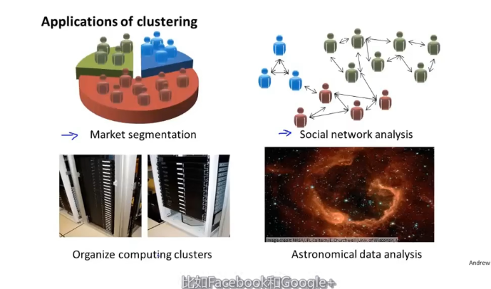
## K-means algorithm
1. 随机选定K(K=2)个聚类中心(cluster centroid),将点分成K类, 依据是离谁进就选谁
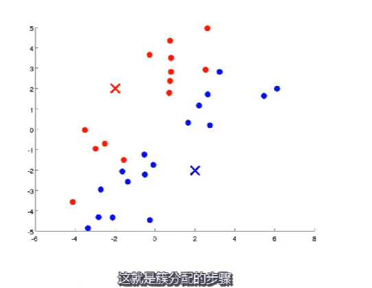
2. 接着对于这两个簇，分别计算其中心，作为新的聚类中心
   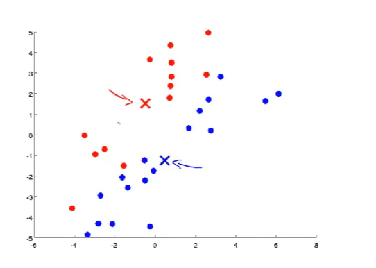
3. 重复上述步骤 簇分配、移动聚类中心
4. 直到算法聚合，即中心不再移动
   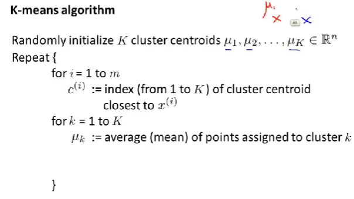
K-means for not well seperated data
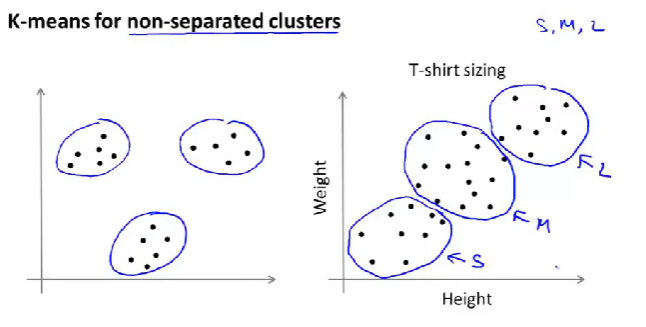

## Clustering Optimization Objective
K-means算法的优化目标是什么，所有样本点到所在聚类的中心距离的平方和的均值。
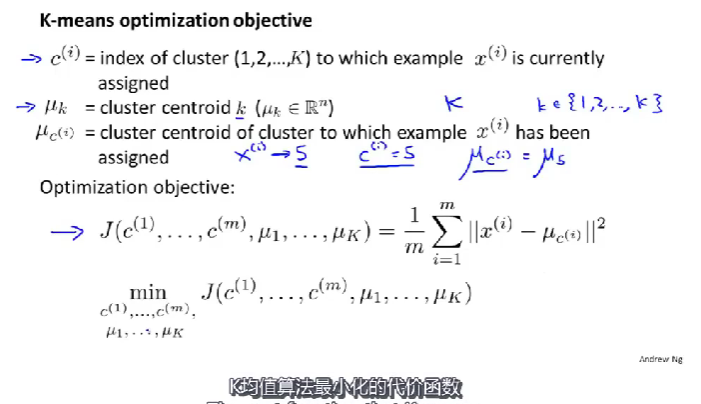

## 随机初始化
如何进行随机初始化
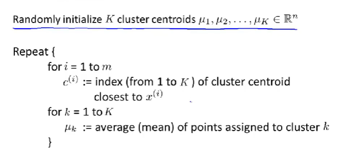
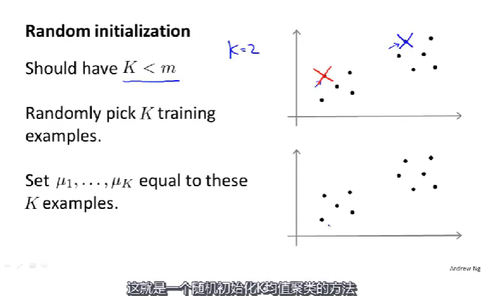
如何避免局部最优？
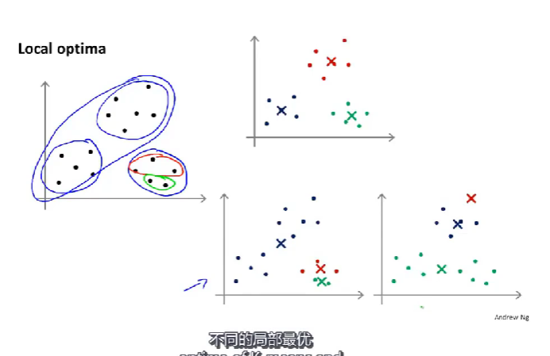
--- 多次随机初始化
## 选择聚类的数量
在没有可视化的图形下，你应该如何选择？
1. elbow method
   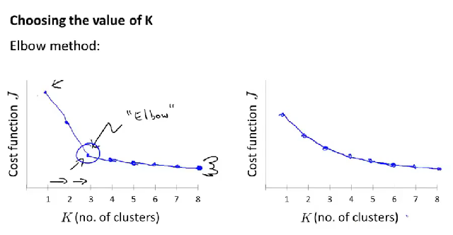
2. 依据需求确定
   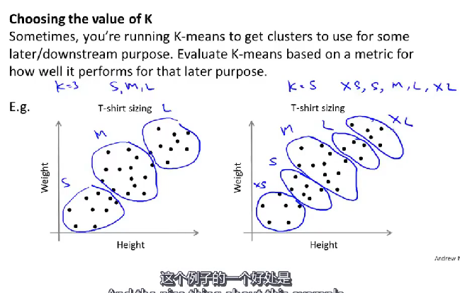

# Dimensionality Reduction-无监督学习的又一个例子
例如：数据压缩(data compressing)，直观而言它帮助我们压缩了数据，使其占用较少的内存空间，另一方面使我们能够对学习算法进行加速

## 什么是降维
高度冗余的特征
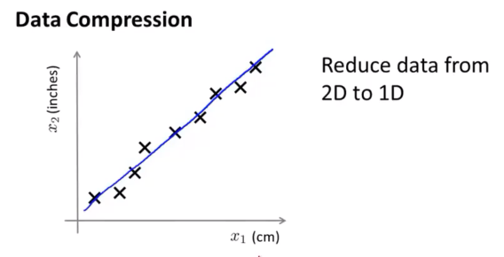
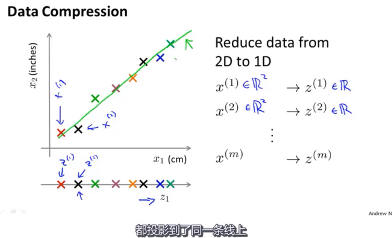
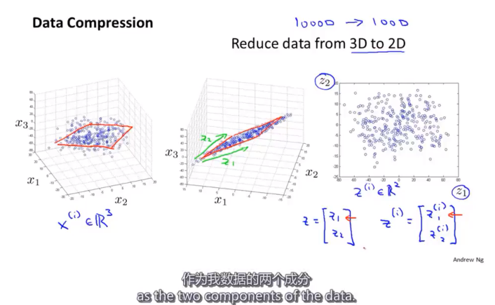

## 降维可用于数据可视化
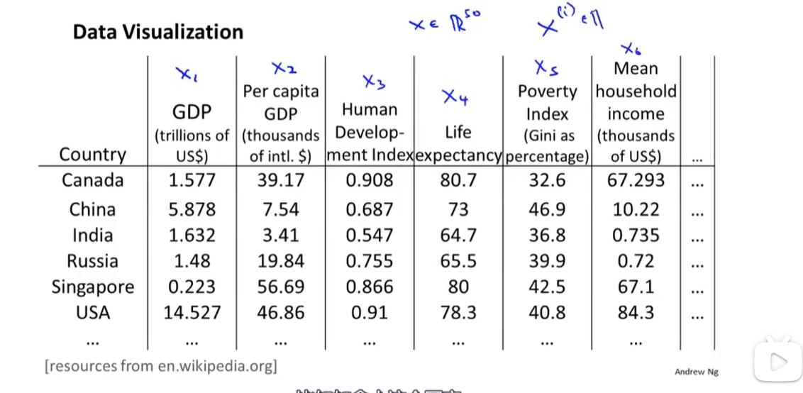
不是用50维，而是尝试使用2维的例如
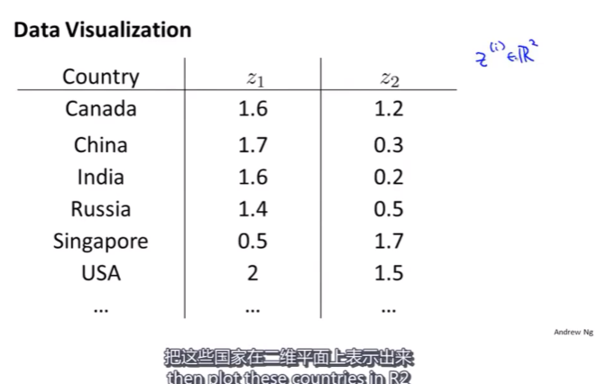
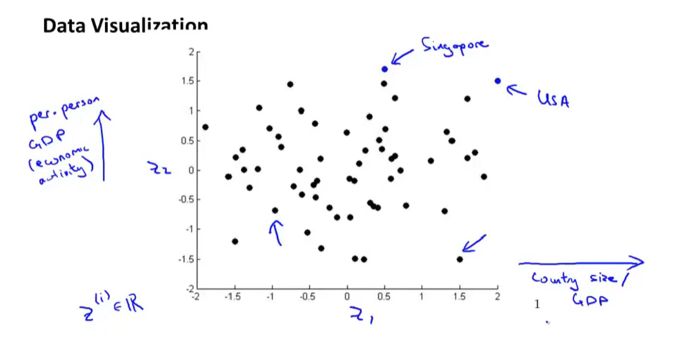

## Principle Components Algorithm(PCA)主成分分析算法
特征规范化、均值归一化后，进行投影

PCA不是Linear Regression
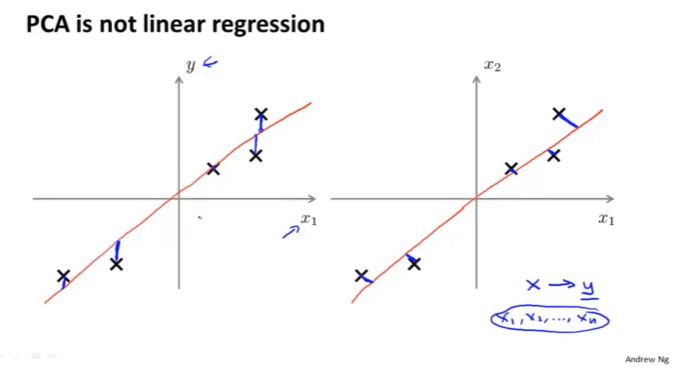
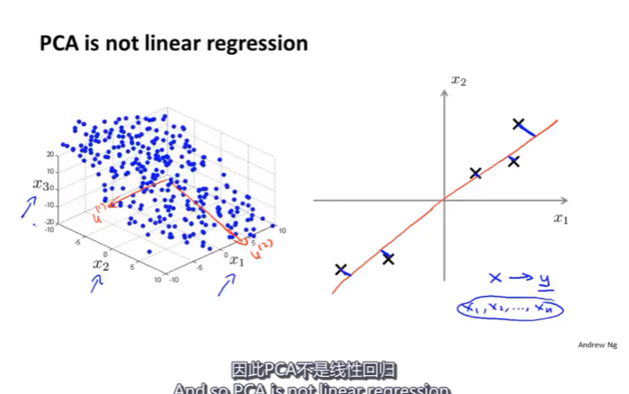

## PCA算法步骤
1. 数据预处理
   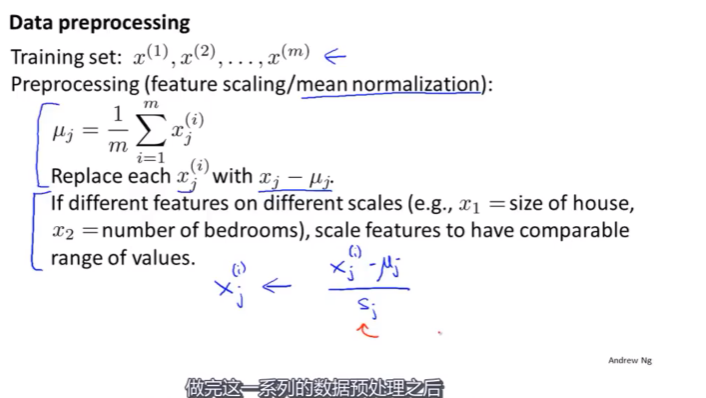

2. 构造协方差矩阵，进行奇异值分解
   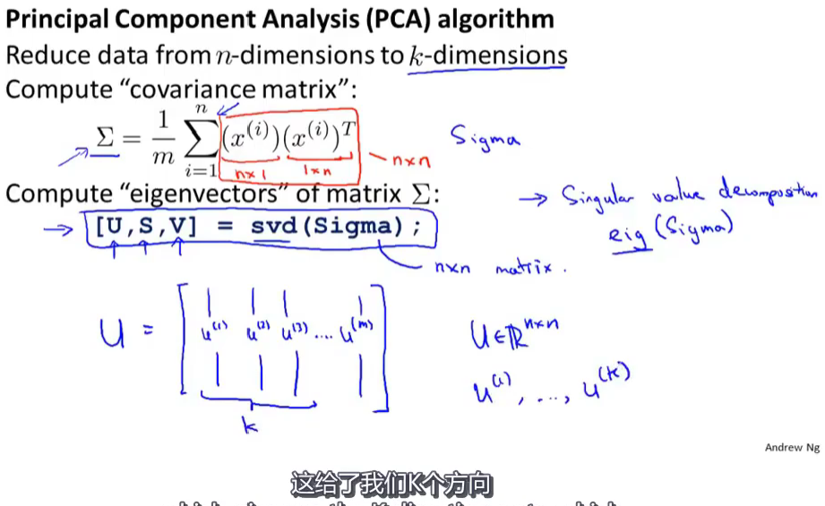

3. 得到压缩矩阵，进行空间映射
   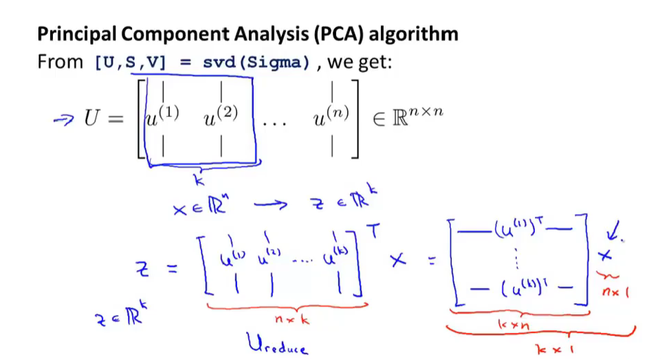
   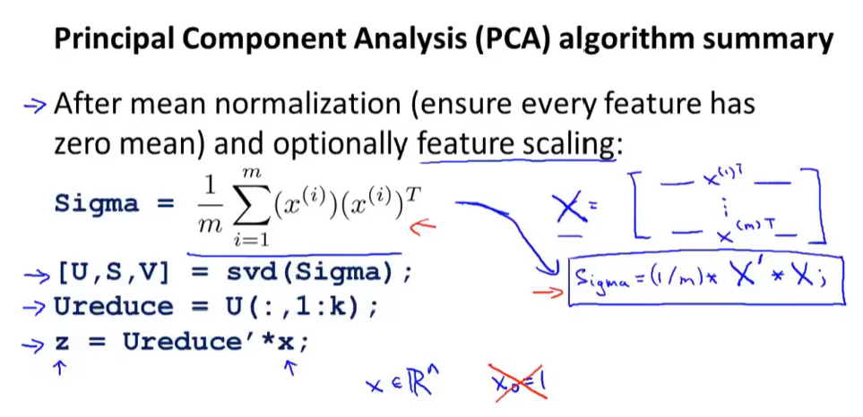

## 如何选择K
Principle Components Number

# 线性代数知识补充
## 特征值与特征向量

## 二次型与正定矩阵

 