# Anomaly dectection 异常检测

建立一个概率模型
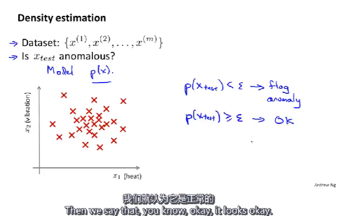
一些实际应用
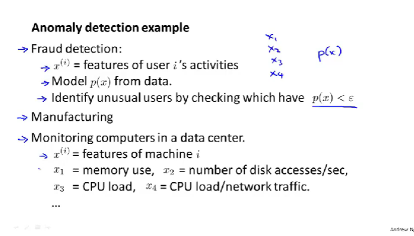
例如 欺诈检测、工艺检测、计算机集群监视

## 高斯分布 or 正态分布
参数估计
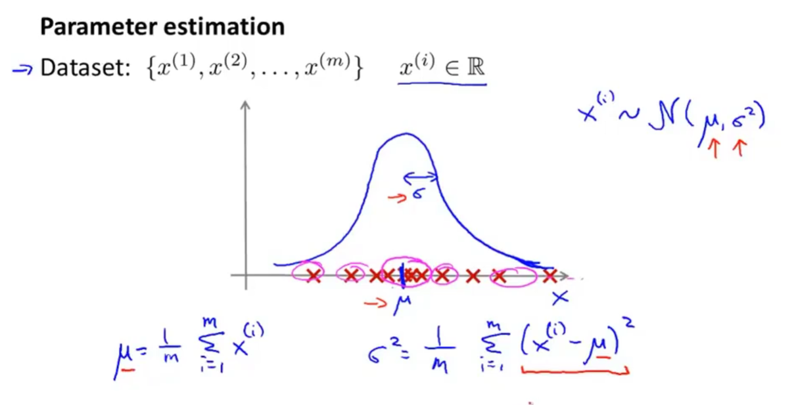

## 概率估计
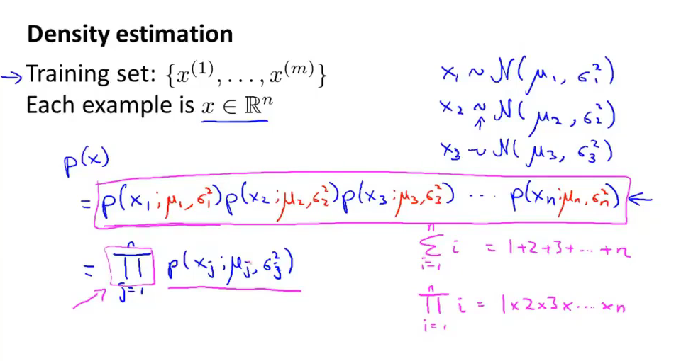
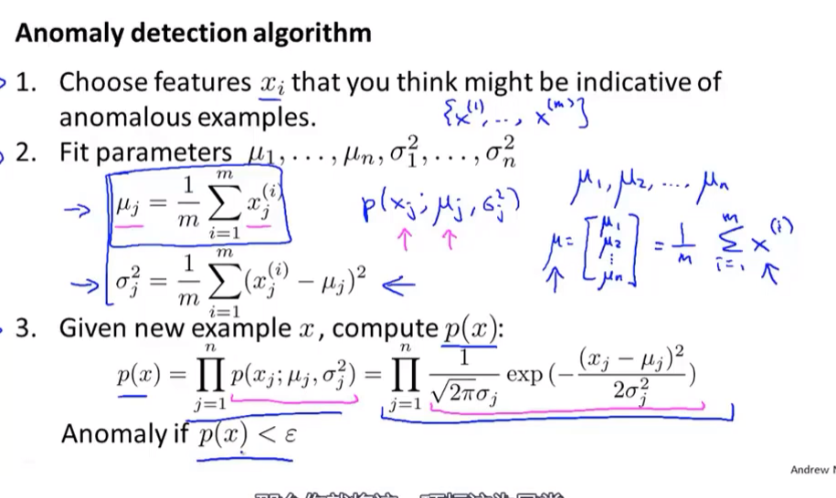
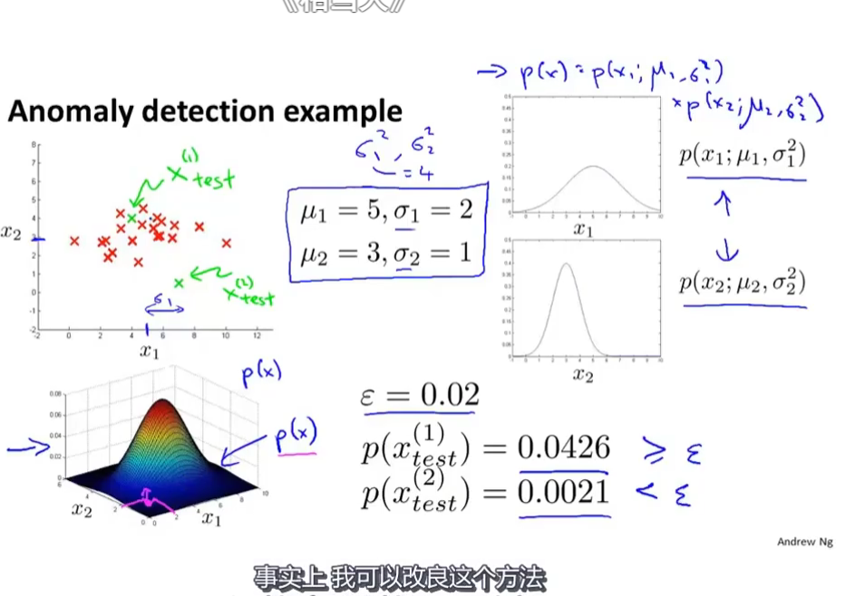

## 异常检测系统
Real-number evaluation

样本划分
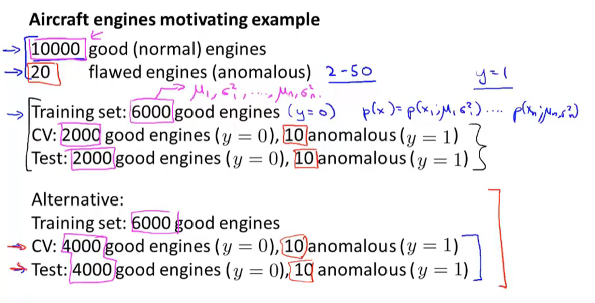
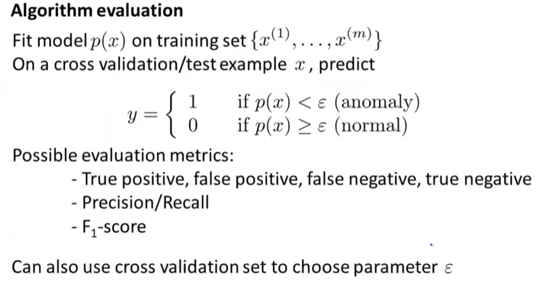
评估异常检测算法的优劣
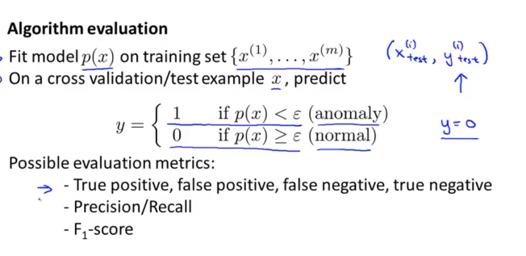

## 监督学习与异常检测
区别与联系
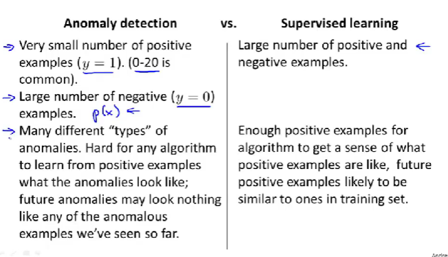

## 如何选择或者设计特征用于异常检测
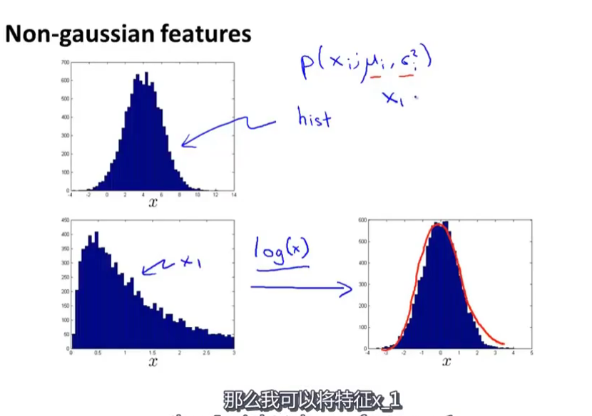
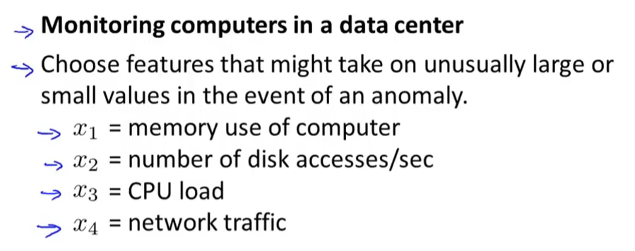

## 特征不独立
例如CPU负载和内存使用量
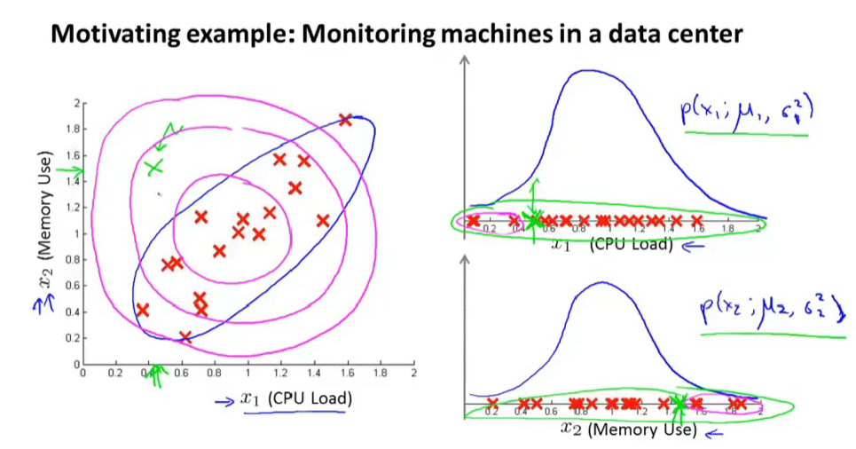
使用多元高斯分布
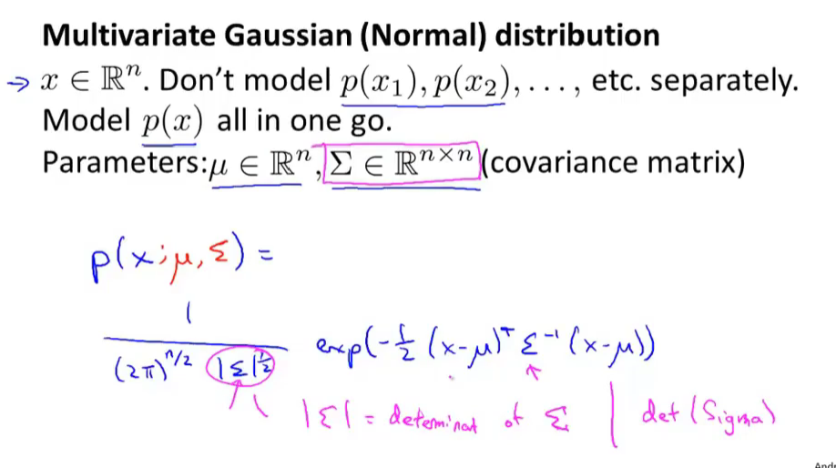

