# Recommender System 推荐系统
## A big idea
自动的学习一系列的特征features

## 事例：电影评分预测
假定评分用星级0-5表示
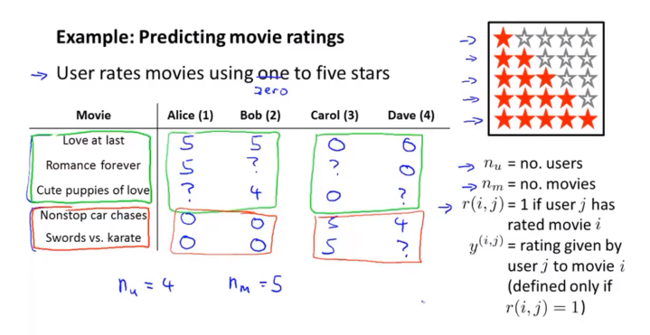
研究的问题是：给出$n_u$ $n_m$ $r(i,j)$ $y^{(i,j)}$，我们能否给出那些未被评分的值

## content-based recommendation
特征描述，情爱内容与动作内容
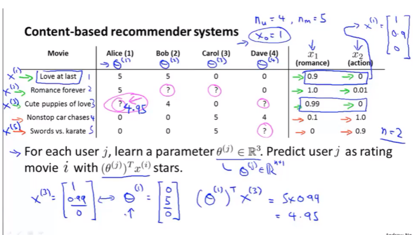
这类似于线性回归
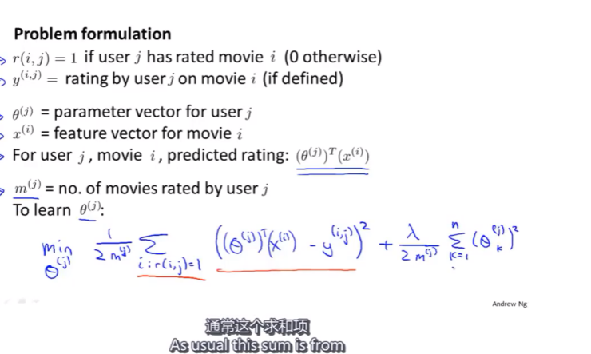
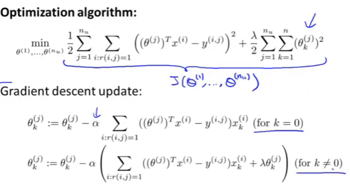

## collaborate filter 协同过滤
如何得到电影的这些特征呢？或者简单一点，我想到了这些特征，怎么得到各个电影的这些特征的值？更进一步，假设我们知道了用户评价，如何推测特征的值?

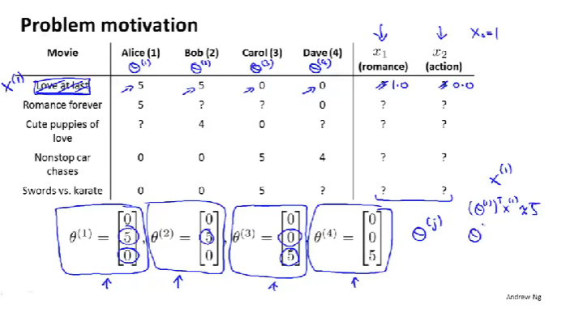

例如Alice喜欢romance电影，她给1号电影评分高，推测1号电影更可能是romance.
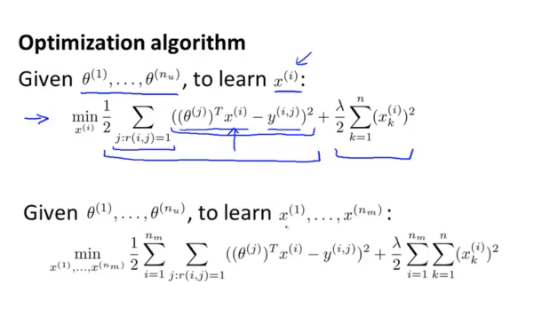
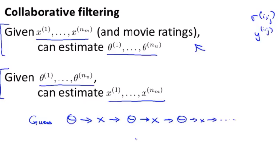

## 协同过滤算法的问题与改进
同时minimize x和 $\theta$
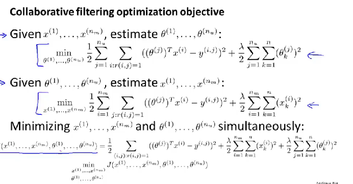

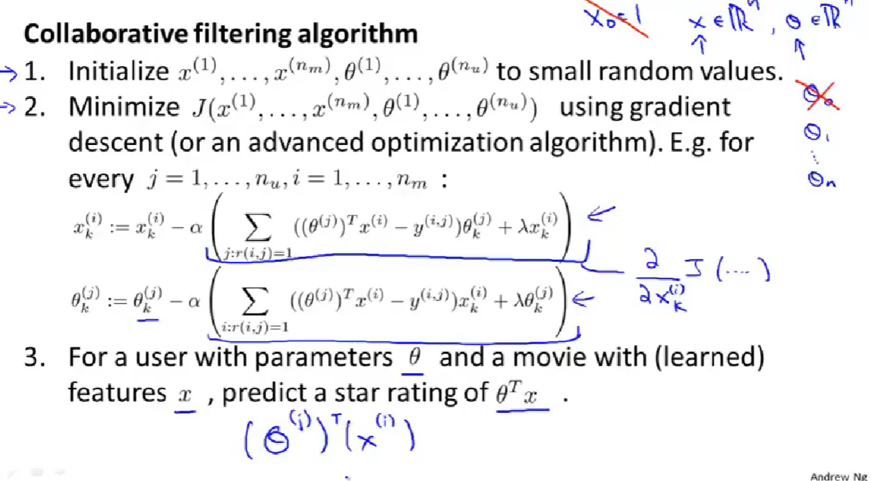

### 相关推荐
也即预测用户可能喜欢（评分高）的电影
Low rank matrix factorization(低秩矩阵分解)

## 未知用户
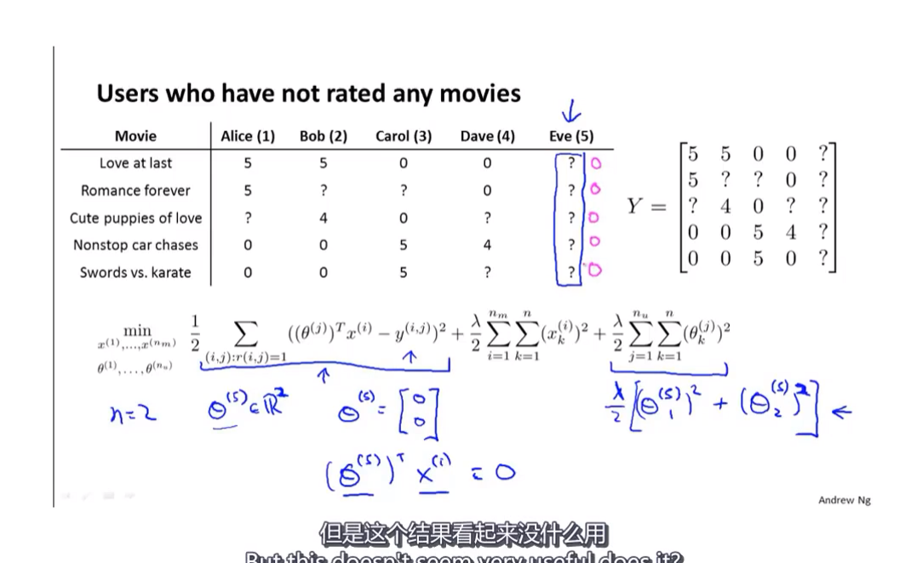
均值归一化
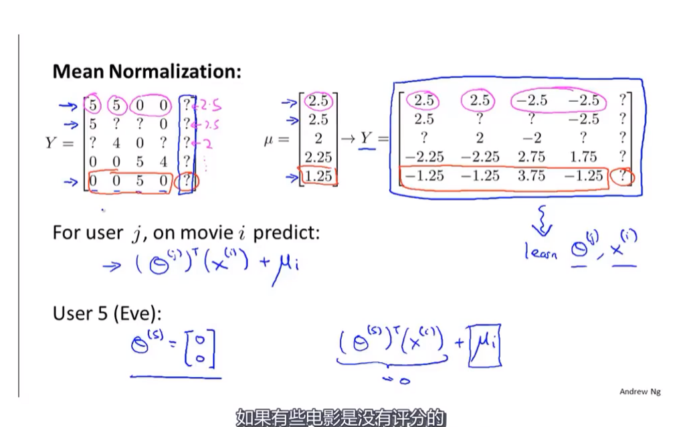

